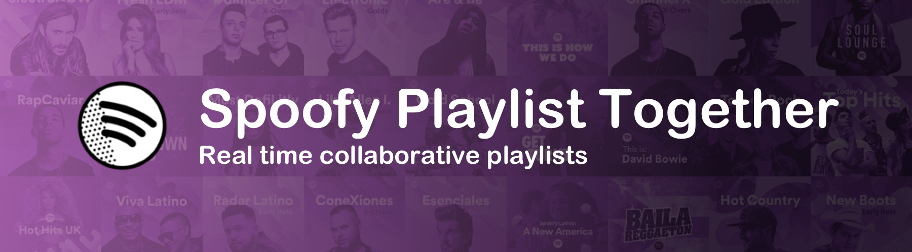
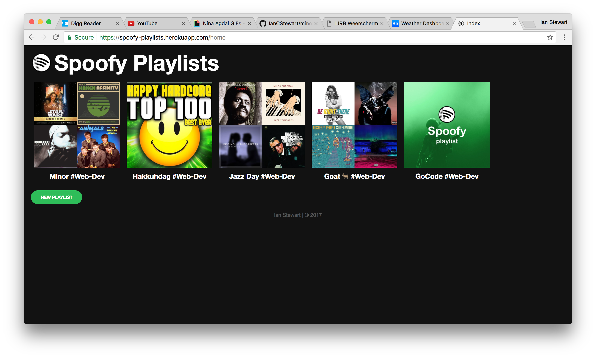

# Minor Real Time Web



> This is a Repo for the course Real Time Web.
> Live link [Here!!!11!1](https://spoofy-playlists.herokuapp.com/)

## The project

The project is to make playlists together. This will be done through sockets. User can add playlists and add songs. The UI is inspired by the UI of spotify.



## Data life cycle

**The data life cycle will be as followed:**

1. Create
2. Store
3. Use on current client
4. Share with other clients
5. Destroy if needed

## Possible socket events

### Server socket events
**nameSpace home**
```
nspHome.on('connection', (client) => {
  // creates a listener for client to emit to
});
```
```
client.on('disconnect', () => {
  // tracks a user leaving home for missed notification
});
```
```
nspHome.emit('playlist', body); // send new playlist to clients
```

**nameSpace playlist**
```
nspPlaylist.on('connection', (client) => {
  // creates a listener for client to emit to
});
```
```
client.on('room', (room) => {
  // to get client join a room when client emits his room
});
```
```
client.on('disconnect', () => {
  // to leave the room a client was in
});
```
```
nspPlaylist.to(`${req.params.playlistId}`).emit('track', body); // send new track to clients
```

### Client socket events
**nameSpace home**
```
socket.on('playlist', function(data) {
  // to show newly added playlist
});
```
**nameSpace playlist**
```
socket.on('connect', function() {
  // to emit the room the client is in to the server
});
```
```
socket.on('track', function(data) {
  // to add newly added songs to the playlist
});
```

## Tooling
### dependencies
- "body-parser": "^1.17.2",
- "cookie": "^0.3.1",
- "cookie-parser": "^1.4.3",
- "debug-http": "^1.1.0",
- "dotenv": "^4.0.0",
- "ejs": "^2.5.6",
- "express": "^4.15.2",
- "lodash": "^4.17.4",
- "node-fetch": "^1.6.3",
- "node-json-db": "^0.7.3",
- "socket.io": "^2.0.1"

### devDependencies
- "babel-eslint": "^7.1.1",
- "eslint": "^3.19.0",
- "eslint-config-airbnb": "^14.0.0",
- "eslint-plugin-import": "^2.2.0",
- "nodemon": "^1.11.0"

### Wishlist
- [ ] use sessions instead of cookies
- [ ] use real database instead of json file
- [ ] Ability to delete songs
- [ ] Ability to delete playlists
- [ ] Better missed notifications

# Getting started
## Cloning

Clone the repository:
```
$ cd ~/Sites/ && git clone git@github.com:IanCStewart/minor-rtw.git && cd minor-rtw
```

Get the node modules:
```
$ npm i
```

## Run server

Run start command for the server:
```
$ npm run start
```

Should return something like this:
```
Server running 0.0.0.0:3000
```

# Contributing

Please read [CONTRIBUTING.md](CONTRIBUTING.md) for details on the code of conduct, and the process for submitting pull requests.

## Author

* **Ian Stewart** - *Initial work* - [IanCStewart](https://github.com/IanCStewart)

## License

This project is licensed under the MIT License - see the [LICENSE.md](LICENSE.md) file for details
